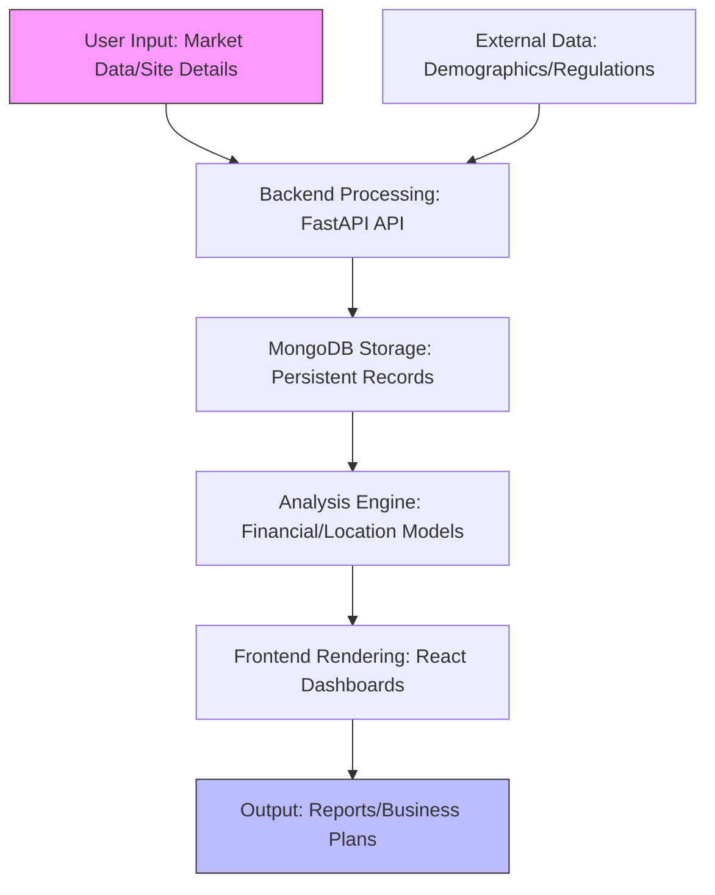
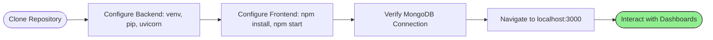
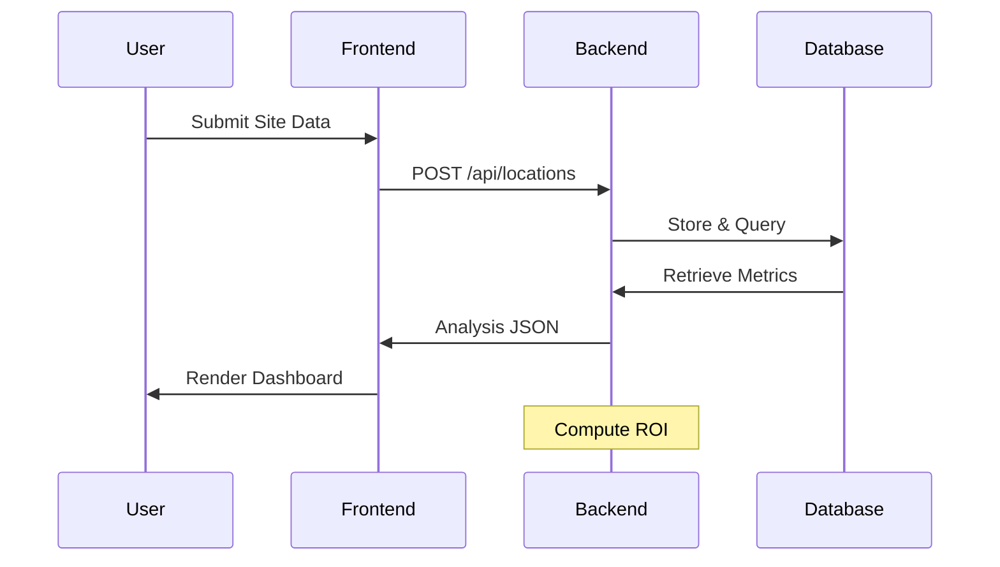

# Comprehensive Beginner's Guide to EVOQ-Energy-EV-Charging-Platform: A Full-Stack Solution for EV Charging Business Management

This guide offers a structured introduction to the **EVOQ-Energy-EV-Charging-Platform**, a comprehensive full-stack web application developed to support entrepreneurs and operators in planning, analyzing, and managing electric vehicle (EV) charging station businesses. The platform integrates market research tools, site evaluation capabilities, financial modeling features, and automated business plan generation, providing a unified environment for strategic decision-making in the burgeoning EV infrastructure sector.

Designed for individuals with limited technical experience, this resource assumes familiarity only with basic computer operations, such as navigating directories or using a web browser. Explanations are presented systematically, incorporating analogies (e.g., likening the platform to a centralized command center for urban planning), illustrative examples, and visual aids including flowcharts and diagrams. Upon completion, readers will be equipped to install, configure, and utilize the application effectively, while gaining insight into its operational principles.

Approach this guide as a professional consultation: each section builds progressively, with practical exercises to facilitate application.

## Overview of EVOQ-Energy-EV-Charging-Platform (Conceptual Framework)

The **EVOQ-Energy-EV-Charging-Platform** is an open-source initiative by developer Jugal Modi, engineered to address the complexities of establishing and operating EV charging networks. It aggregates data-driven insights to evaluate market viability, optimize site selection, forecast financial outcomes, and streamline administrative processes, thereby reducing the barriers to entry for sustainable energy ventures.

- **Rationale for Accessibility**: The application requires no proprietary software; deployment occurs via standard development environments, yielding interactive dashboards and reports accessible through a web interface.
- **Analogy**: Consider the platform as an integrated operations hub, akin to a mission control room for space launches, where disparate data streams (market trends, site metrics) converge to inform precise actions.
- **Principal Modules**:
  - **Market Research**: Demographic tracking, competitor analysis, and growth forecasting.
  - **Location Evaluation**: Traffic assessment, proximity mapping, and revenue projections.
  - **Financial Modeling**: ROI computations, cost simulations, and scenario analyses.
  - **Business Management**: Supplier directories, compliance checklists, and plan automation.

The architecture employs a decoupled frontend-backend paradigm, leveraging modern frameworks for scalability and maintainability.

**Graphical Depiction: Systemic Workflow Diagram**

The following diagram outlines the platform's data flow (renderable via mermaid.live):



This representation illustrates the progression from input to actionable intelligence.

## Essential Requirements: Preparation for Deployment

Verify the following prerequisites to ensure seamless initiation. Each is accompanied by verification steps.

1. **Development Environment**: A computing device with Python 3.8 or later and Node.js 14 or later installed.
   - **Acquisition**: Download Python from python.org and Node.js from nodejs.org.
   - **Validation**: Execute `python --version` and `node --version` in a terminal interface.

2. **Database Infrastructure**: MongoDB, either locally installed or via a cloud service (e.g., MongoDB Atlas).
   - **Setup Example**: Install via official documentation; obtain a connection string for configuration.

3. **Version Control Tool**: Git, for repository retrieval.
   - **Alternative**: Direct ZIP download if Git is unavailable.

4. **Network Access**: Required for dependency installation; subsequent operations are local.

**Advisory**: Allocate approximately 30 minutes for initial configuration in a dedicated workspace.

## Deployment Procedure: Initiating the Application

Deployment follows a bifurcated process for backend and frontend components, ensuring modularity.

### Phase 1: Repository Acquisition
- Access [GitHub Repository](https://github.com/jugalmodi0111/EVOQ-Energy-EV-Charging-Platform).
- Execute `git clone https://github.com/jugalmodi0111/EVOQ-Energy-EV-Charging-Platform.git` or download the ZIP archive and extract to a preferred directory (e.g., Desktop).

**Analogy**: This step equates to sourcing raw materials for assembly—essential components are now centralized.

### Phase 2: Backend Configuration
1. Navigate to the `backend` subdirectory: `cd EVOQ-Energy-EV-Charging-Platform/backend`.
2. Establish a virtual environment: `python -m venv venv`, followed by activation (`source venv/bin/activate` on Unix-based systems; `venv\Scripts\activate` on Windows).
3. Install dependencies: `pip install -r requirements.txt`.
4. Duplicate the environment template: `cp .env.example .env`, then edit `.env` to include the MongoDB connection string (e.g., `MONGO_URL=mongodb://localhost:27017/`).
5. Launch the server: `uvicorn server:app --reload --host 0.0.0.0 --port 8001`.

### Phase 3: Frontend Configuration
1. Transition to the `frontend` subdirectory: `cd ../frontend`.
2. Install dependencies: `npm install --legacy-peer-deps`.
3. Configure the API endpoint in `.env` (e.g., `REACT_APP_API_BASE_URL=http://localhost:8001`).
4. Initiate the development server: `npm start`.

Access the application at `http://localhost:3000` (frontend) and `http://localhost:8001/docs` (API documentation).

**Graphical Aid: Deployment Sequence**



## Foundational Principles: Component Analysis

Prior to utilization, examine the core elements—comparable to reviewing structural blueprints.

### 1. Backend Framework: FastAPI and MongoDB
FastAPI facilitates asynchronous API development, while MongoDB provides flexible, schema-less storage for heterogeneous data (e.g., market metrics, site coordinates).
- **Operational Mechanism (Analogy)**: Analogous to a high-efficiency logistics dispatcher, routing queries and persisting records without bottlenecks.
- **Illustration**: A POST request to `/api/market-data` ingests city demographics, yielding JSON responses for frontend consumption.

### 2. Frontend Interface: React and Tailwind CSS
React manages stateful components, with Tailwind enabling responsive, utility-driven styling.
- **Analogy**: Resembles a modular construction kit, assembling interactive panels (e.g., ROI calculators) from reusable primitives.
- **Illustration**: The location analysis dashboard visualizes traffic heatmaps, updating in real-time via Axios-fetched data.

### 3. Integration Layer: API Endpoints
Endpoints bridge modules, supporting CRUD operations and computations.
- **Example**: `GET /api/location-analysis/{location_id}` retrieves site viability scores, incorporating traffic and competitor data.

**Schematic: API Interaction Cycle**

```
[Frontend Request (Axios)] --> [FastAPI Endpoint (Validation via Pydantic)] --> [MongoDB Query] --> [Analysis Computation] --> [JSON Response] --> [UI Update (React State)]
          ^                                                                                  |
          |----------------------------------------------------------------------------------|
```

This cycle ensures data integrity and responsiveness.

## Practical Utilization: Navigating the Core Modules

Upon launch, the interface presents a dashboard. Engage sequentially to simulate a business evaluation.

### Principal Workflows (Illustrated)
Maintain focus on one module per session for clarity.

1. **Market Research Module**
   - **Functionality**: Input city parameters; retrieve adoption trends and projections.
   - **Illustration**: Enter "New York" → Dashboard displays EV penetration (e.g., 15% growth YoY) and competitor density maps.
   - **Exercise**: Populate data for two cities; compare market sizes.

2. **Location Evaluation Module**
   - **Functionality**: Submit site coordinates; assess traffic, proximity, and revenue potential.
   - **Illustration**: Upload a mall address → Output: Estimated daily sessions (200), peak-hour utilization (75%).

3. **Financial Modeling Module**
   - **Functionality**: Define costs and scenarios; compute ROI and break-even points.
   - **Illustration**: Model a 4-station setup ($50K capex) → Results: 18-month payback at 80% utilization.

4. **Business Management Module**
   - **Functionality**: Track suppliers and generate plans.
   - **Illustration**: Select partners → Auto-generate a 10-page PDF outline, including regulatory notes.

**Practical Exercise**: Evaluate a hypothetical site—input data, model finances, and export a plan. Note variances in assumptions (e.g., utilization ±10%).

**Advanced Attributes**:
- **Real-Time Visualizations**: Interactive charts via integrated libraries.
- **Compliance Integration**: Embedded checklists for local regulations.
- **Export Capabilities**: CSV/PDF for stakeholder reports.

## Extension Opportunities: Customization and Scalability

The modular design accommodates enhancements.

- **Data Integration**: Incorporate external APIs (e.g., Google Maps for traffic).
  - **Illustration**: Modify `/api/locations` to query real-time data, enhancing accuracy.
- **Scenario Expansion**: Add multi-site portfolio analysis.
  - **Rationale**: Facilitates enterprise-level planning, demonstrating extensibility.

**Graphical Aid: Workflow Progression**



## Internal Mechanics: Operational Overview

For analytical purposes: Modifications optional.

1. **Initialization**:
   - Backend loads via `server.py`; frontend via `index.js`.
   - CORS configuration enables cross-origin requests.

2. **Request Handling**:
   - Pydantic validates inputs; Motor asynchronously interfaces with MongoDB.
   - Computations employ NumPy for modeling (e.g., revenue = sessions × rate × utilization).

**Code Excerpt (From Backend—Observational)**:
```python
from fastapi import FastAPI
app = FastAPI()

@app.post("/api/market-data")
async def add_market_data(data: MarketData):
    # Validation and storage logic
    return {"status": "success", "id": str(ObjectId())}
```
This endpoint exemplifies structured data handling.

**Performance Considerations**: Asynchronous operations support concurrent users; scale via cloud MongoDB.

## Resolution of Anomalies

| Anomaly | Etiology | Remediation |
|---------|----------|-------------|
| Connection Refusal (MongoDB) | Invalid URI | Verify `.env` string; test via `mongosh`. |
| Dependency Conflicts | Version Mismatch | Use `--legacy-peer-deps` in npm; recreate venv. |
| Port Conflicts | Existing Services | Alter `--port` (e.g., 8002); terminate processes. |
| Blank Interface | API Misconfiguration | Confirm `REACT_APP_API_BASE_URL` alignment. |
| Installation Failure | Missing Prerequisites | Reinstall Python/Node; consult documentation. |

**Illustrative Resolution**: Persistent 404 errors? Inspect `/docs` for endpoint availability.

## Advancement Pathways: Proficiency Enhancement

- **Customization**: Fork the repository; integrate additional datasets (e.g., energy pricing APIs).
- **Further Resources**: Explore FastAPI tutorials (fastapi.tiangolo.com) and React documentation (react.dev).
- **Contribution**: Propose features like predictive analytics; submit via pull request.
- **Application**: Deploy to Vercel/Heroku for collaborative access.

## Epilogue

This platform equips users with robust tools to navigate the EV charging landscape strategically. Through methodical engagement, one transitions from conceptual understanding to practical implementation, fostering informed decision-making in sustainable infrastructure. For inquiries, reference [Repository Discussions](https://github.com/jugalmodi0111/EVOQ-Energy-EV-Charging-Platform/discussions).

Strategic foresight drives innovation—proceed with deliberate application.

*Guide Prepared: December 16, 2025 | Edition 1.0*
